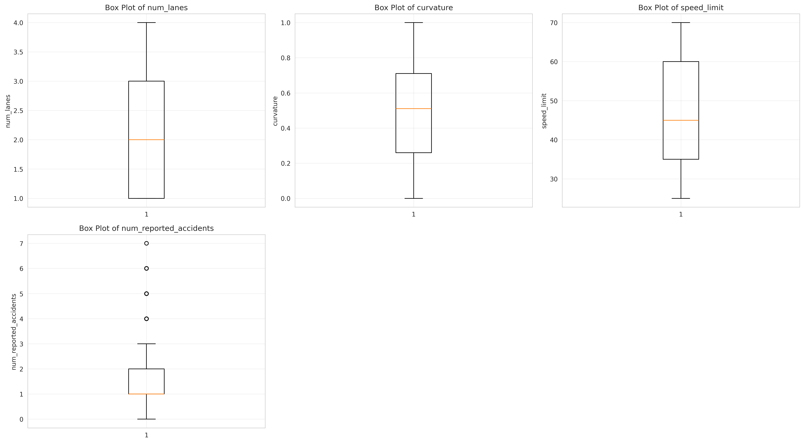

# Kaggle Accident Risk Prediction

A machine learning pipeline for predicting accident risk using XGBoost regression with automated hyperparameter optimization via Optuna.

## Overview

This project implements an end-to-end ML pipeline that:
- Performs feature engineering with interaction terms
- Optimizes XGBoost hyperparameters using Optuna with 5-fold cross-validation
- Trains a final model with early stopping
- Generates predictions for Kaggle submission

## Features

### Feature Engineering
- **Interaction Features**: Creates multiplicative interactions between numeric features
- **One-Hot Encoding**: Categorical variables encoded with `drop_first=True`
- **Column Alignment**: Ensures train and test sets have identical feature columns

### Hyperparameter Optimization
- **Framework**: Optuna with TPE (Tree-structured Parzen Estimator) sampler
- **Validation**: 5-fold cross-validation for robust evaluation
- **Metric**: Root Mean Squared Error (RMSE)
- **Trials**: 100 optimization trials

### Optimized Parameters
The pipeline tunes 11 XGBoost hyperparameters:
- `n_estimators`: Number of boosting rounds (500-3000)
- `learning_rate`: Step size shrinkage (0.005-0.2)
- `max_depth`: Maximum tree depth (4-10)
- `subsample`: Row sampling ratio (0.6-1.0)
- `colsample_bytree`: Column sampling per tree (0.6-1.0)
- `colsample_bylevel`: Column sampling per level (0.6-1.0)
- `colsample_bynode`: Column sampling per split (0.6-1.0)
- `reg_alpha`: L1 regularization (1e-8 to 10.0)
- `reg_lambda`: L2 regularization (1e-8 to 10.0)
- `min_child_weight`: Minimum sum of instance weight (1-10)
- `gamma`: Minimum loss reduction for split (1e-8 to 1.0)

## Requirements

- Python >= 3.12
- pandas
- numpy
- scikit-learn
- xgboost
- optuna

## Installation

Using [uv](https://github.com/astral-sh/uv) (recommended):

```bash
uv sync
```

Or using pip:

```bash
pip install pandas numpy scikit-learn xgboost optuna
```

## Usage

### Basic Execution

```bash
python main.py
```

Or with uv:

```bash
uv run python main.py
```

### Expected Output

1. **Optimization Phase**: Progress bar showing 100 Optuna trials
2. **Best Parameters**: Display of optimal hyperparameters found
3. **Best CV RMSE**: Cross-validated performance metric
4. **Final Training**: Model training with early stopping
5. **Validation RMSE**: Performance on hold-out validation set
6. **Submission File**: `submission.csv` generated in `/kaggle/working/`

### File Structure

```
.
├── main.py           # Complete ML pipeline
├── train.csv         # Training data (with 'id', 'accident_risk', and features)
├── test.csv          # Test data (with 'id' and features)
├── pyproject.toml    # Python dependencies
├── uv.lock           # Locked dependency versions
├── CLAUDE.md         # Development guidelines
└── README.md         # This file
```

## GPU Configuration

By default, the script uses GPU acceleration:
```python
tree_method="gpu_hist"
device="cuda"
```

**For CPU-only environments**, edit `main.py` lines 64-65:
```python
tree_method="hist"
device="cpu"
```

## Pipeline Architecture

```
┌──────────────┐
│ Load Data    │
│ train.csv    │
│ test.csv     │
└──────┬───────┘
       │
       ▼
┌──────────────────────┐
│ Feature Engineering  │
│ - Numeric interactions│
│ - One-hot encoding   │
└──────┬───────────────┘
       │
       ▼
┌──────────────────────┐
│ Optuna Optimization  │
│ - 100 trials         │
│ - 5-fold CV          │
│ - RMSE minimization  │
└──────┬───────────────┘
       │
       ▼
┌──────────────────────┐
│ Final Model Training │
│ - Best parameters    │
│ - Early stopping     │
│ - 90/10 train/val    │
└──────┬───────────────┘
       │
       ▼
┌──────────────────────┐
│ Generate Predictions │
│ submission.csv       │
└──────────────────────┘
```

## Model Details

- **Algorithm**: XGBoost Regressor
- **Target Variable**: `accident_risk`
- **ID Column**: `id`
- **Validation Strategy**:
  - Cross-validation during optimization (5-fold)
  - Hold-out validation for final model (10%)
- **Early Stopping**: Enabled during final training

## Output

The script generates `/kaggle/working/submission.csv` with:
- `id`: Test sample identifier
- `accident_risk`: Predicted risk score

Statistics printed:
- Min, max, and mean predicted values
- Final validation RMSE

## Performance Metrics

The pipeline reports:
1. **Cross-Validation RMSE**: Average across 5 folds during optimization
2. **Validation RMSE**: Performance on final hold-out set
3. **Best Parameters**: Optimal hyperparameters found by Optuna

## Exploratory Data Analysis

The project includes a comprehensive EDA script (`analysis_exploratory.py`) that generates detailed visualizations and statistical summaries of the training data.

### Running the EDA

```bash
python analysis_exploratory.py
```

This will create an `eda_plots/` directory with all visualizations and a statistical summary report.

### Generated Visualizations

#### 1. Target Variable Distribution


Analysis of the `accident_risk` target variable showing:
- **Histogram**: Frequency distribution with mean and median indicators
- **Box Plot**: Quartile distribution and outlier detection
- **KDE Plot**: Kernel density estimation for smooth distribution visualization

#### 2. Numeric Features Distribution


Histograms for all numeric features in the dataset, revealing:
- Distribution shapes (normal, skewed, uniform, etc.)
- Value ranges and scales
- Potential data quality issues

#### 3. Outlier Detection


Box plots for all numeric features using the IQR (Interquartile Range) method to identify:
- Median values and quartiles
- Outliers and extreme values
- Feature variability and spread

#### 4. Correlation Matrix


Comprehensive correlation heatmap showing:
- Feature-to-feature correlations
- Correlation with target variable
- Potential multicollinearity issues
- Strong positive (red) and negative (blue) relationships

#### 5. Feature Importance by Correlation


Bar chart ranking features by absolute correlation with `accident_risk`:
- Green bars: Positive correlation
- Red bars: Negative correlation
- Helps identify most predictive features

#### 6. Feature vs Target Scatter Plots


Scatter plots of the top 9 most correlated features versus the target:
- Shows relationship patterns (linear, non-linear, clusters)
- Includes trend lines for each feature
- Displays correlation coefficients

#### 7. Feature Relationships (Pairplot)


Pairwise relationships between the top 5 most correlated features:
- Diagonal: KDE plots showing individual distributions
- Off-diagonal: Scatter plots showing feature interactions
- Useful for identifying feature combinations and patterns

#### 8. Categorical Feature Distribution


Bar charts for each categorical variable showing:
- Value frequency distributions
- Class imbalance identification
- Rare category detection

#### 9. Target by Category


Box plots showing `accident_risk` distribution across categorical groups:
- Identifies which categories have higher/lower risk
- Shows variance within each category
- Helps assess categorical feature importance

#### 10. Outlier Summary


Comprehensive outlier analysis showing:
- Number of outliers per feature
- Percentage of dataset affected
- Features requiring potential treatment

### Statistical Summary

A detailed text report (`eda_plots/statistical_summary.txt`) is generated containing:
- Dataset dimensions and feature counts
- Missing value analysis
- Descriptive statistics (mean, std, min, max, quartiles)
- Target variable statistics
- Top correlated features with target
- Outlier counts and percentages for each feature

This EDA provides critical insights for feature engineering, data cleaning, and model selection decisions.

## Development

See [CLAUDE.md](CLAUDE.md) for detailed development guidelines and architecture notes.

## License

This project is open source and available for educational purposes.
